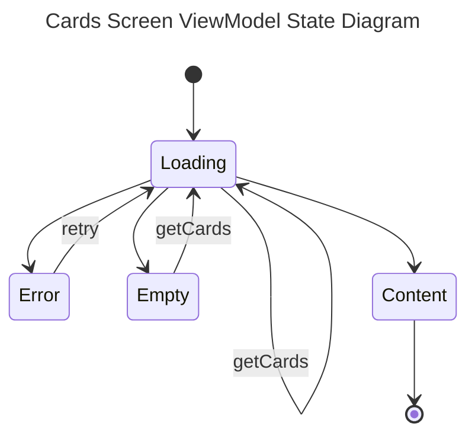

```mermaid
---
title: Cards Screen ViewModel State Diagram
---

stateDiagram-v2
    [*] --> Loading
    Loading --> Loading: getCards
    Loading --> Error
    Error --> Loading: retry
    Loading --> Empty
    Empty --> Loading: getCards
    Loading --> Content
    Content --> [*]
```